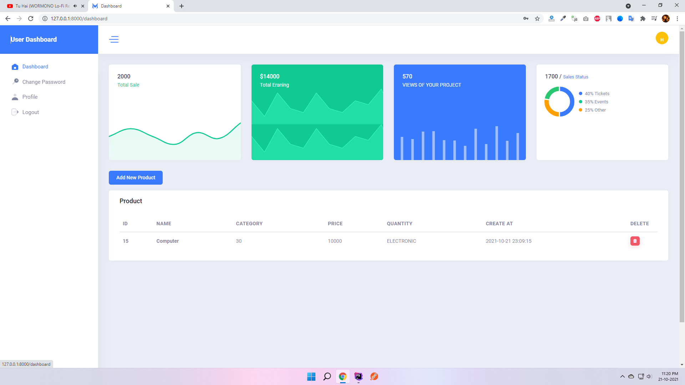
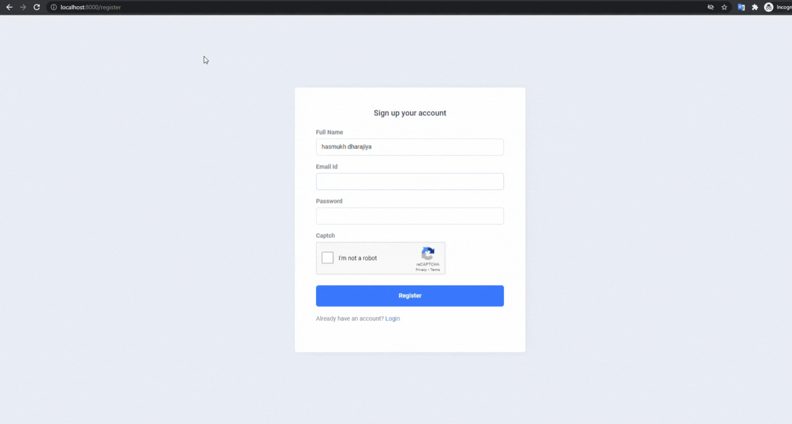
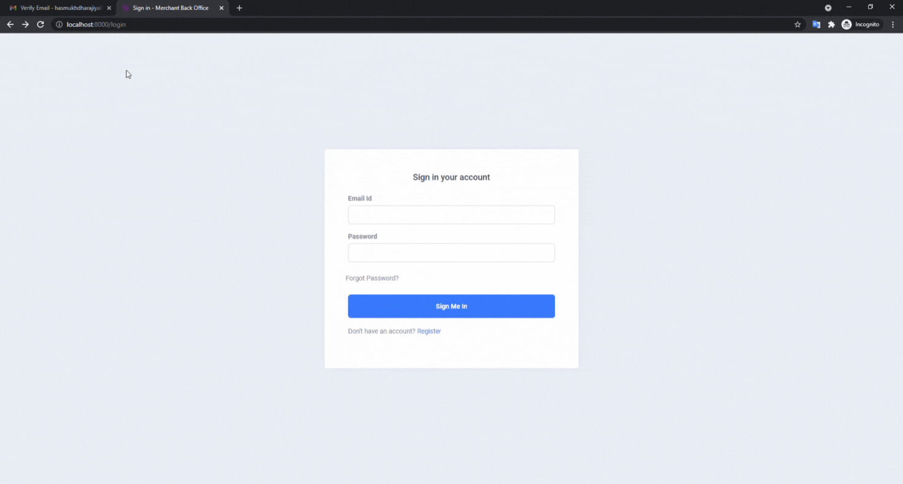

## custom-laravel-dashboard
custom Laravel dashboard. Real World Laravel 8x Dashboard. Dashboard features such as: Custom Authentication, Google re-captcha, Email Verification, custom-login-register-forgot password (without jetstream or Livewire).

## How to use
1. git clone `git clone https://github.com/hasmukh-dharajiya/custom-laravel-dashboard.git`
2. Copy `.env.example file to .env`
3. Edit database credentials in .env file `DB_DATABASE=dashboard`
4. Run `composer install`
5. Run `php artisan key:generate`
6. Run `php artisan migrate`
7. Open `.env` file ang following code For send an Email using Gmail SMTP Server
```
MAIL_MAILER=smtp
MAIL_HOST=smtp.gmail.com
MAIL_PORT=587
MAIL_USERNAME=      #Your Email ID #
MAIL_PASSWORD=      #Your Email Password #
MAIL_ENCRYPTION=tls
MAIL_FROM_ADDRESS=  #Your Email ID #
MAIL_FROM_NAME="${APP_NAME}"
```
7. Open `.env` file ang following code for [Google recaptcha](https://www.google.com/recaptcha/admin)
```
NOCAPTCHA_SITEKEY=     # site key #
NOCAPTCHA_SECRET=      # secret key # 
```
8. Run `php artisan ser`
9. `http://localhost:8000/`

`Note`: Please make sure Turn ON `Less secure app access` in your Google account other wise Email Not Send !. [Click here..](https://myaccount.google.com/security)

You should see the list of Data, something like this:



## Feature
Key Feature of Project.

- Responsive Template use in dashboard
- Use Google recaptcha
- Use email Google and Laravel feature
- Custom Authentication System (without jetstream)
- Email Send for Conformation Email
- verify email, reset password email (custom codding)
- Laravel Bla     de Template
- Register,Login and forgot password without jetstream (custom codding)

`Note`: Please make sure Turn ON `Less secure app access` in your Google account without Email Not Send !. 
- Please Following:- `Manage your Google Account => Security => Less secure app access =>Trun ON` 

## Register View


## Forgot Password View


## dashboard View

